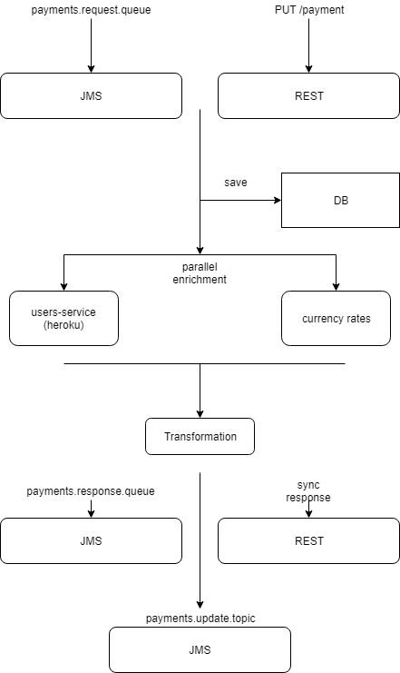

# SI-task

## Разрабатываем систему платежей. 

### Общие сведения
Система может принимать запросы или c помощью REST-endpoint или с помощью JMS-queue. 
REST: Формат запроса JSON или XML. Формат ответа JSON или XML (смотрим в Accepted-type header)
JMS: Формат запроса-ответа JSON. 

Сущности на JMS брокере: 
```
payments.request.queue
payments.response.queue
payments.update.topic
```

Для определения типа запроса в JMS сообщении используем header REQUEST_TYPE: CREATE or GET

#### Внешние системы
* JMS Broker (ставим локально, например Apache MQ) - для request/response
* DB (подключаем in-memory, например H2) - для хранения информации о платежах
* Privat/NBU REST API - web-service для получения курсов валют
* https://mighty-chamber-51017.herokuapp.com/ - web-service для получения данных о пользователях

#### Сущности системы
##### Payment
```
long id;
String description;
PaymentStatus status;
User user;
LocalDateTime date;
double amount;
String currency;
```

##### PaymentStatus (enum)
```
REQUESTED
REJECTED
ACCEPTED
```

##### User
```
long id;
String firstName;
String lastName;
boolean isActive;
```


### Запросы обрабатываемые системой
#### CreatePayment - создание заявки на проведения платежа
1. Система принимает запрос в формате JSON, например:
```
{
   "description": "Test payment",
   "user": {
      "id": 1
      },
   "amount": 270.25,
   "currency": "UAH"
}
```
Или XML, например:
```
<request>
   <description>Test payment</description>
   <user>
      <id>1</id>
   </user>
   <amount>270.25</amount>
   <currency>UAH</currency>
</request>
```

2. Сохраняет платеж во внутренней базе данных, генерирует ID для платежа.
3. Производит enrichment информацией о валютах и юзере. (Optional and parallel enrichment, ждем 5 секунд)
4. Отправляет ответ пользователю в нужно формате.
JSON:
```
{
   "id": 1,
   "description": "Test payment",
   "user": {
      "id": 1,
      "firstName": "Alex", // получаем во время енричмента через heroku 
      "lastName": "Nitavskiy" // получаем во время енричмента через heroku
       },
   "status": "REQUESTED",
   "date": "2018-03-03 18:00:03",
   "amount": 270.25,
   "currency": "UAH",
   "amountInUSD": 10.25, // получаем во время енричмента через NBU
   "amountInEUR": 8.75 // получаем во время енричмента через NBU
}
```
XML:
```
<response>
   <description>Test payment</description>
   <user>
      <id>1</id>
   </user>
   <amount>270.25</amount>
   <currency>UAH</currency>
   <status>REQUESTED</status>
   <date>2018-03-03 18:00:03</date>
   <amountInUSD>10.25</amountInUSD>
   <amountInEUR>8.75</amountInEUR>
</response>
```
5. Отправляет сообщение в JMS topic

Schema: 



#### GetPayment - Получение платежа по id
Для REST: GET /payment/{id}
Для JMS: 
```
<request>
   <id>1</id>
</request>
```

1. Система получает запрос по получение информации о платеже.
2. Производит enrichment информацией о валютах и юзере. (Optional and parallel enrichment, ждем 5 секунд)
3. Отправляет ответ пользователю в нужно формате. (см. пример create_payment)

#### Генерация платежей на основании файлов на FTP (в нашем случае локальной папки)
1. Слушаем папку на файловой системе на добавление новых файлов
2. При добавлении файла вычитываем его содержимое, оно должно быть представлено в формате XML и содержать один или несколько запросов на создание платежа. Предусмотреть возможность обработки нескольких платежей из одного файла.
3. Добавляем платежи в базу данных.
4. Удаляем обработанные файлы.
5*. Включаем\выключаем сканированние файловой системы через JMX

#### Процессинг платежей в статусе REQUESTED с помощью задачи по расписанию
1. Каждые 5 минут планировщик проверяет базу данных на наличие новых платежей в статусе REQUESTED.
2. Для каждого платежа проверет является ли пользователь активным. (Пользователей не кешируем!!!) 
3. Если да, переводим платеж в статус ACCEPTED
4. Если нет, в статус REJECTED
5*. Отправляем на почту список ACCEPTED и REJECTED платежей. 